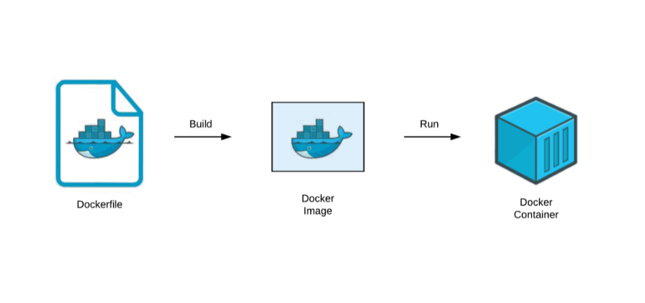
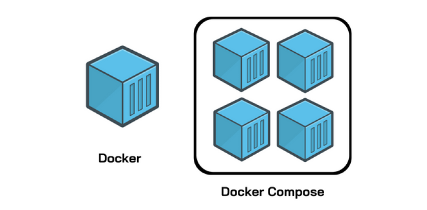
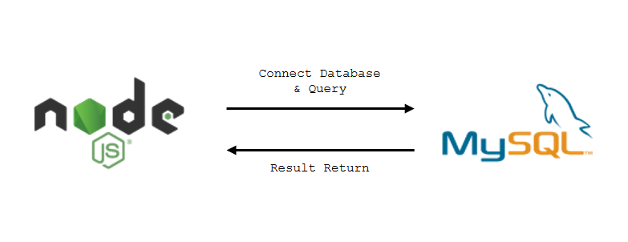

# Trabalho Prático de Sistemas Distribuídos: MySQL + Node.js + Docker

Este projeto demonstra a integração de contêineres Docker para criar uma aplicação Node.js conectada a um banco de dados MySQL. A arquitetura é composta por dois contêineres independentes: um para o servidor Node.js e outro para o servidor MySQL.

## O que é o Docker?



O Docker é uma plataforma de código aberto que permite automatizar o processo de implantação de aplicativos dentro de contêineres leves e portáteis. Criar, integrar e manter a consistencia dos ambientes.

- <strong>Contêineres</strong>: Um contêiner é uma instancia executavel de uma imagem docker que pode incluir o codigo do aplicativo, bibliotecas, dependencias e configurações.

- <strong>Dockerfile</strong>: Define as configuraçoes para construir uma imagem docker.

- <strong>Imagens docker</strong>: Uma imagem Docker é um pacote que inclui todas as dependências e configurações necessárias para executar um aplicativo.

- <strong>Docker hub</strong>: O Docker Hub é um repositório público de imagens Docker. 

- <strong>Orquestradores de contêineres</strong>: Ferramentas como <strong>Docker Compose</strong>, Kubernetes e Docker Swarm ajudam a gerenciar e orquestrar contêineres em ambientes de produção.

- <strong>Docker Compose</strong>: 
O Docker Compose é uma ferramenta que permite definir e gerenciar aplicativos Docker multicontainer. Com o Docker Compose, você pode definir um aplicativo em um arquivo YAML, especificando os serviços, redes e volumes necessários para executar o aplicativo. Isso facilita a criação, execução e escalonamento de aplicativos Docker complexos.

  - <strong>Serviços</strong>: Cada contêiner em um aplicativo Docker Compose é chamado de serviço. Um serviço geralmente representa uma parte específica do aplicativo, como um servidor web, um banco de dados, entre outros.

  - <strong>Redes</strong>: O Docker Compose permite definir redes para conectar os serviços. Isso é útil para estabelecer comunicação entre os contêineres de diferentes serviços ou restringir o acesso à rede.

  - <strong>Volumes</strong>: Volumes são usados para persistir dados além do ciclo de vida de um contêiner. Ao usar volumes, você pode garantir que os dados permaneçam intactos mesmo que os contêineres sejam interrompidos ou removidos.

  - <strong>Arquivo YAML</strong>: A configuração do Docker Compose é definida em um arquivo YAML, que descreve todos os aspectos do aplicativo, como serviços, redes, volumes, variáveis de ambiente e outros parâmetros.

  

  O arquivo docker-compose.yml que define um aplicativo web e um banco de dados foi definido da seguinte forma na aplicação, lembrando que dependendo das configurações do banco de dados e nodeJs pode ser alterado:

  ```yaml
  version: '3'
  services:
    mysql:
      image: mysql:latest
      restart: always
      environment:
        MYSQL_ROOT_PASSWORD: admin
        MYSQL_DATABASE: meu_banco
        MYSQL_USER: admin
        MYSQL_PASSWORD: admin
      ports:
        - "3306:3306"
      volumes:
        - ./db:/docker-entrypoint-initdb.d
        
    node-app:
      image: node:latest
      container_name: node-app-container
      working_dir: /app
      volumes:
        - ./app:/app
      depends_on:
        - mysql
      ports:
        - "3000:3000"
      command: >
        bash -c "npm install && npm start"
      environment:
        DATABASE_HOST: mysql
        DATABASE_PORT: 3306
        DATABASE_USER: admin
        DATABASE_PASSWORD: admin
        DATABASE_NAME: meu_banco

## Arquitetura
A arquitetura do projeto é baseada em contêineres Docker, com dois serviços principais:

- Node.js Service:
  - Hospeda a aplicação Node.js responsável por interagir com o banco de dados MySQL.
  - Pode ser construído a partir de uma imagem oficial do Node.js ou ser instalada no proprio server.

- MySQL Service:
  - Contém o servidor MySQL.
  - Pode ser construído a partir de uma imagem oficial do MySQL.
  - Configurações, como nome de usuário, senha e banco de dados, são fornecidas por meio de variáveis de ambiente no Docker Compose ou dockerfile.

  

 A relação entre o contêiner do MySQL e o contêiner do Node.js é uma arquitetura de software. Esses contêineres são instâncias isoladas de aplicativos que podem ser implantadas, gerenciadas e escaladas independentemente.

O sistema final, acessado pelo usuário através do navegador, se apresenta como uma entidade única, apesar de ser, na verdade, um sistema distribuído. O Docker atua como um middleware, fornecendo uma camada abstrata que encapsula as aplicações em contêineres.

Essa arquitetura segue um modelo descentralizado, pois os contêineres são isolados e podem ser implantados em hosts distintos. Essa abordagem oferece benefícios como escalabilidade e redundância, proporcionando uma infraestrutura mais resiliente e flexível. O uso de variáveis de ambiente no Docker Compose ou Dockerfile contribui para a flexibilidade da configuração, permitindo adaptações conforme necessário durante a implantação e a manutenção do sistema.

## Instalação do Docker
  Para instalar o Docker na sua versão Desktop ou via terminal deve-se seguir as instruções no site oficial do Docker: <a href="https://docs.docker.com/get-docker/">Get Docker</a>.

## Executando o Projeto
1. Clone o repositorio

`git clone git@github.com:felipecarvalhogodoi98/1trabalho_pratico_sd.git`

2. Execute o Docker Compose para construir e iniciar os contêineres:

`docker-compose up -d`

3. Após o container ser construido e iniciado, acesse a aplicação em <a href="http://localhost:3000">http://localhost:3000</a>

## Observações
- No diretorio /db existe uma configuração inicial para o banco, criando tabelas e inserindo alguns dados de teste.
- Não se esqueça de parar e remover os contêineres quando não estiver usando o projeto

`docker-compose down`

- O Dockerfile é usado para construir imagens de contêineres individuais, especificando a configuração e os comandos necessários para a construção.

- O Docker Compose é usado para utilizar vários contêineres como uma aplicação única, definindo a configuração, relacionamentos e dependências entre eles em um arquivo YAML.

- O Dockerfile pode ser utilizado apenas para buildar as imagens e os containeres serem orquestrados pelo Docker Compose

